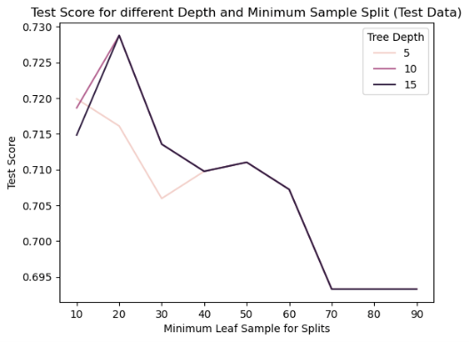

# eBay auction competitiveness prediction
### eBay auction competitiveness prediction model
### Executive Summary
The study investigated an auction dataset that included 1,972 transaction records on eBay from May to June 2004. The data comprises 8 variables: product Category, Currency in given prices, SellerRating on eBay, auction Duration, EndDay which indicated the day of the week the auction ended, ClosedPrice which implied the item sold price, OpenPrice which is the original price set by the seller, and an indicator variable “Competitive?” which illustrated whether the transaction had more than one bid. The goal was to find an effective decision tree that could forecast whether a transaction would be competitive or not based on the information available at the start of an auction.
Prior to data modelling, the predictors underwent data preparation in which categorical variables were converted to dummy variables. An exploratory data analysis (EDA) was further conducted to examine the distribution and trend of provided variables. To the dataset, total three decision tree models with varying combination of predictors would be fitted. The first decision tree was built using all available predictors and has an accuracy score of 0.8276. Because the close price was unknown when an auction is posted, a more practical full class decision tree was performed on all variables except the target variable and ClosePrice. However, the prediction accuracy for this functional model fell to 71.10%. After evaluating feature importance, the third decision tree was only dependent on Category, Currency, SellerRating and OpenPrice. This is the optimal decision tree in the report, with relatively clear decision rules and a 72.24% forecasting precision. Furthermore, the report includes a section that discussed the possibility of a duplication problem in the eBay auction dataset in order to clarify the assumptions.
Based on the findings of the models and data, we recommend that eBay sellers set a relatively low opening price, improve their seller rating, offer to sell in GBP, choose a 5-day auction period, and set the close date to Monday to enhance competitiveness of their auctions. Considering the model performance in identifying the competitiveness of auctions, the model could significantly assist the decision making of the eBay sellers.
### Introduction
eBay is an e-commerce company that enables consumer-to-consumer and business-to-consumer sales through auctions via their internet platform. Anyone can register to sell a product on eBay, if their address is amongst the authorized countries or regions. The product is sold to the highest bidder once the auction time period has ended. Data from 1,972 auctions that were transacted on eBay.com between May and June 2004 was collected. The data contains information on the auction category, the seller’s eBay rating, the auction duration, opening price, currency, day of week the auction will close on and the closing price of the auction. Auction categories identify the selling products category such as Automotive or Sporting Goods. 
The purpose of this report is to discuss the results of a model that classifies whether an auction is competitive or not on the eBay platform. A competitive auction is defined as an auction that receives at least two bids and this information is available for all 1,972 auctions collected. The goal is to identify recommendations to improve the likelihood of a seller’s auction of being competitive. This will be beneficial for sellers as competitive auctions result in a product being sold at a higher price as it has multiple bidders who are willing to pay for the product. Python’s machine learning library, scikit-learn, will be used to develop a Decision Tree classification model. 
This report will first discuss any data preparation and exploratory data analysis (EDA) steps. Followed by the results of developing multiple decision tree models with different predictor variables and concluding with a formal recommendation to eBay sellers.
### Data Preparation and Exploratory Data Analysis
Decision trees do not require much data preparation as normalization of predictor variables is not required. The data is complete, meaning that there are no missing values in any of the predictors for all 1,972 auctions. As scikit-learn does not currently support categorical variables [1], the categorical variables in the data set were converted to dummy variables so that they are integers of 0 or 1. The categorical variables in the data set include the sale product’s category, the currency, the duration of the auction and the day of the week the auction closed on. The data set was also inspected for duplicate rows, i.e., rows that contain all the same values for each column in the data table. There were 346 duplicate rows detected, example rows are shown below. These auctions have products from the same category, are priced in the same currency, from a seller with the same rating score and the same auction duration, auction end day of the week and opening/closing prices. As the seller rating is the same for these auctions it is likely the same seller, however, the data does not contain the seller’s account information, therefore, it is not possible to confirm. It is possible that the seller is selling multiple of the same item in different auctions. Since it is possible for two sellers to have the same rating and for a seller to list the same item (i.e., the seller could be selling two identical video games) in two auctions it was decided to keep these duplicate rows in the dataset. However, an analysis without duplicates will be discussed later in this report.

For a decision tree to classify competitive auctions, the dataset must include a sufficient number of auctions that are competitive and not competitive. From the 1,972 auctions collected, 1,066 auctions were competitive while 906 were not competitive which is a 54-46 split and is therefore, well balanced.
Bar plots were generated for categorical variables to visually identify any relationships amongst competitive and non-competitive auctions. The y-axis is in percentage, and the sum of the bars of the same colours equates to 100%. The bar plot below shows that the majority of auctions close between Friday and Monday and are open for five or seven days. Auctions that close on Mondays and are five days long tend to be the most competitive auctions. Auctions closing on the remaining days of the week (except Thursday) tend to have more non-competitive auctions. Auctions closing on Wednesdays and only one day long are the least common auctions on the eBay platform. The category of products was also analyzed and is not shown in this report, however products from the Music/Movie/Game category tend to be the most competitive, however, this category also makes up 20% of the auctions in this dataset which is the most common.

Box plots were generated for continuous variables such as the seller rating and the opening price. The y-axis was set to a range that allowed for meaningful visual comparisons between competitive and non-competitive auctions, therefore, there are many higher points of sellerRating and opening price that are not shown in these figures. It appears that competitive auctions tend to have slightly lower seller ratings and lower opening prices. The lower opening prices is intuitive as more buyers may be attracted to place a bid on a cheaper item, however, assuming that higher seller rating is better, the box plot results is counter intuitive for seller rating one may expect auctions posted by sellers with higher seller ratings to be more competitive as their seller rating is a sign of their quality. 

### Decision Tree Including All Predictors
With a partition ratio of 60 - 40, the dataset was randomly divided into a training dataset and a testing dataset. Initially, we attempted to construct a decision tree using all predictors from the eBay auction dataset. We fit the model on the training dataset and set the minimum number of records in a leaf node to 50 to prevent overfitting. The fitted decision tree has a 0.8436 accuracy rate on the training dataset. The model was then applied to the test dataset, yielding an accuracy rate of 0.8276, which is not significantly lower than the training accuracy. The full class decision tree was depicted in Figure 4. This tree has 6 levels of depth and 27 decision nodes, including the root node. The first rule for the entire decision tree was whether the OpenPrice is less than or equal to 3.615. Then, the next decision node is whether the ClosePrice is smaller or equal to 3.645 for low OpenPrice records and whether the SellerRating is smaller or equal to 601.5. The following decision nodes were all about open and close prices, with the exception of one at the fifth depth that determines whether the transacted product category is automotive. 
From the full model, we may extract the insight that only OpenPrice, ClosePrice, SellerRating and Category variables affect the classification. According to our findings thus far, we can conclude that splits were performed primarily on continuous variables (OpenPrice, ClosePrice, and SellerRating) rather than dummy variables. Furthermore, if the OpenPrice is less than 3.615 dollars, the sellerRating appears to be unimportant in terms of auction competitiveness; buyers will choose based on price. SellerRating is only relevant for products priced above 3.615 which is interesting but intuitive since individuals purchasing cheaper products may not put as much emphasis on the seller’s rating. The fact that price and seller rating were the primary splits is not surprising, however, one would think that these predictors depend on the product’s category as some categories will tend to have higher or lower prices. Therefore, more splits regarding the product category were expected, but this may not have occurred because of the unbalanced amount of data from each product category, and in general the small number of data in the dataset (< 2000 auctions). Because the blue and orange nodes in the full class decision tree are blended together with no clear distribution trend, a decision tree with all predictors may not be optimal, and we would attempt several varying models.

Nevertheless, this full model was not the best decision tree with all the independent variables we had. The grid search with depths [5, 10, 15] and minimum records in the split of [10, 20, 30, 40, 50, 60, 70, 80, 90] were used. Figure 5 demonstrates the trend of cross-validation (CV) accuracy score and test accuracy score, as well as the change in minimum leaf sample. Despite the fact that both graphs show that the score declines as the number of minimum leaf samples grows, overfitting may arise if the number of records in leaf node is too small. The grid search yields the best CV score of 0.8461 for a decision tree with 10 maximum depths and 10 minimum required sample.

This model, however, is not practical for predicting the outcome of a new auction because it is dependent on the ClosePrice, which will only become available after the auction is completed. At that point, predicting whether an auction is competitive is meaningless. The study's objective is to predict competitiveness once a new auction is posted. As a result, with the exception of ClosePrice, we fitted a new decision tree to all predictors. The accuracy dropped to 0.7287 on the training dataset and 0.7110 on the test dataset. To avoid overfitting, the previous model's grid search was repeated, generating a best CV score of 0.7219 for a decision tree with 5 depths and 90 minimum required records. Figure 6 shows the CV score and test score trends with the increase in minimum leaf samples for the new model. The new accuracy score is 0.7481 on the training dataset and 0.7148 on the test dataset.

Figure 7 depicts the decision tree without ClosedPrice which is the best estimator in the grid search with cross validation. Although the predicted accuracy decreased significantly compared to the previous model, the clarity of the decision rule appears to have improved slightly. Only 3 out of 13 decision nodes under the root node where OpenPrice less than or equal to 3.615 are yellow. However, classifications in the right branch remain muddled. The splits were primarily conducted on continuous variables OpenPrice and SellerRating remain unchanged which would be the selected predictors if we had to reduce the number of predictors in the model.

### Decision Tree with Selected Predictors
After conducting the model with all variables, we found the accuracy score is 0.715. We use the feature importance function to examine the utility of each variable and thus plotting a bar chart to see their corresponding score. The plot shows that only 8 features are important in this model, with the rest of them having a feature importance of 0. However, we decided to delete ClosePrice because this information is not available at the time of predicting the target variable. In the second model, the following parameters were included in the model: Category, Currency, SellerRating, OpenPrice into the model. The accuracy score of the second model increases slightly to 0.7224.

A tree plot was generated and has a height of 7. The first split is based on the value of OpenPrice. When the OpenPrice is less than 3.615, 547 of the data will be further examined by if the openPrice is less 1.805, and 636 of the data is further classified by the criteria of whether sellerRating is smaller than 601.5. The gini is 0.497, which means 49.7% of the data will be misclassified when selected randomly. Next, the second layer of tree is split based on OpenPrice and sellerRating. If the OpenPrice is less than 1.805, 139 out of 537 data will be further examined on their currency and the rest will be examined by the SellerRating.

A scatter plot with x axis being OpenPrice and y axis being sellerRating was generated for this decision tree. From the plot, we can verify the result of the tree. When the OpenPrice is smaller than 3.615, most of the data is in blue section, which means the price is competitive. For the dots whose openPrice is bigger than 3.615 and sellerRating situated in the range of (137, 601.5), their price is not competitive. For the auctions whose sellerRating is smaller than 137, their price is competitive. We found that there is a large portion of the graph blank. This is because in this area the dots are too sparsely distributed and the decision tree algorithm cannot classify them into different criteria, complying the minimum number of records in a terminal node should be bigger than 50. Moreover, the existing tree does not generate a plausible splitting criterion, because we can easily find many not competitive dots (blue dots) appearing in the blue section of the graph. Since the observations from competitive and non-competitive auctions are not very differentiable, drawing a perfect separation line is not possible when restricting the node to make split decisions on 50 or more observations. Therefore, this splitting is not very reasonable.
Based on this tree model, we would predict a new auction by first investigating its openPrice. If the openPrice is smaller than 3.615, it is highly probably that the auction is competitive. Next, we should investigate the sellerRate. If the sellerRate is smaller than 601.5 but bigger than 137, it is highly probable that the auction is not competitive.

The confusion matrix below for the model with selected variables demonstrates that there is misclassification error, almost equal amounts of false positives and false negatives when it comes to predicting a competitive auction. Since the prediction of a competitive auction is at the benefit of the seller, there is not much risk in incorrectly classifying an auction other than a seller may choose not to auction their product or the auction will not get any bids. In the scenario where the auction does not get any bids the seller does not lose anything and they can try auctioning their product again as there are no costs associated with creating an auction on eBay if the seller is does not frequently sell products.
